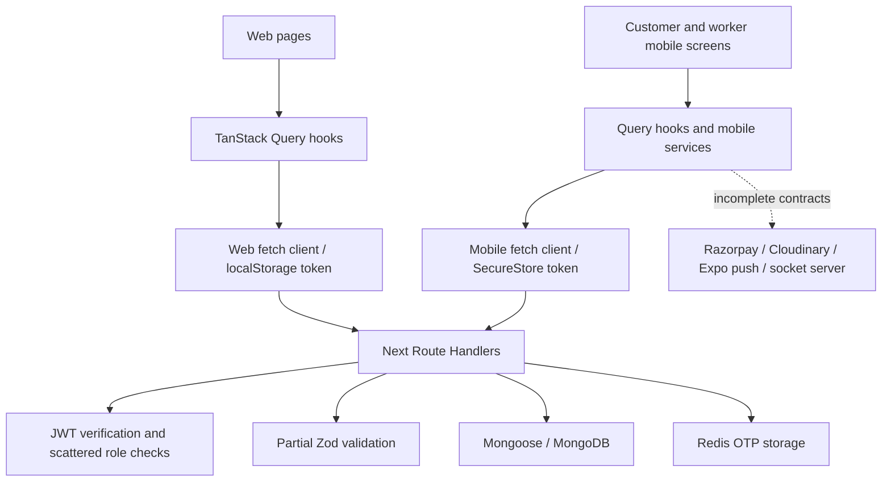

# Architecture overview

Read with [audit scope and evidence limits](codebase-audit.md). Paths are relative to repository root.

| Area | Actual implementation | Boundaries |
| --- | --- | --- |
| Web | `web/src/app`, 15 observed page files including landing + 14 admin pages | No customer/worker web workspace or login page |
| API | `web/src/app/api/*/route.ts` | Same Next deployment, no separate backend package |
| Persistence | `web/src/lib/models`, `db.ts` | Cached Mongoose connection; localhost fallback; no migration runner |
| Auth | `auth.ts`, `auth-middleware.ts`, API auth handler | JWT + password hashing + Redis OTP; no refresh/revoke endpoint |
| Mobile | `mobile/App.tsx`, `src/navigation/AppNavigator.tsx` | One app, two role tab sets, six common screens |
| State | Query providers in each app; mobile authSlice; web placeholder Redux | No cross-platform DTO/schema package |
| Providers | Mobile Razorpay, Cloudinary upload, Expo push, socket.io client | Client code exists; corresponding secure server integrations incomplete |
| Assets/UI | Web Base UI wrappers and Tailwind tokens; mobile constants/Logo | Separate renderers; duplicated branding/status/color definitions |
| Operations | package scripts, app.json, next.config.ts, `.env.example` | No CI/deploy manifests, EAS profiles, backup jobs or monitoring config found |

Normal list: UI → query key/params → fetch → auth (where required) → query/filter → Mongoose populate/lean → response envelope → page. Mutations generally invalidate only their entity list. Financial totals, auth identity and status transitions are not consistent across this chain.

Auth flow: mobile phone → send-otp → Redis → no SMS adapter → verify-otp → find/create User → sign JWT → SecureStore/Redux. New-user creation omits required password. API returns `user.id`; mobile consumers predominantly expect `_id`. Restoring saved credentials does not validate expiration/account state. Web request helpers read localStorage, but no working login/guard completes the journey.

Database relationship graph: User → WorkerProfile/ContractorProfile/PaymentMethod; Job → customer User, worker User, ServiceCategory and embedded subcategory identifier; Project → customer/contractor Users and embedded milestones; Payment → Job and customer/worker; Payout → worker; Attendance → Job/worker/customer; Dispute → Job/raiser/resolver. Commission uses a string category key; PromoCode stores campaign constraints. There is no message, notification, session, audit event or quote collection in the observed model inventory.

Recommended boundaries: Route Handler (transport) → current principal → permission plus resource policy → schema → domain operation → repository/provider → safe DTO. Extract only operations requiring shared invariants (job transition, attendance approval, payment reconciliation, KYC decision). Retain Next and Expo; a rewrite or microservices split is not justified by this audit.

Configuration: server-only MONGODB_URI, REDIS_URL, JWT_SECRET/JWT_REFRESH_SECRET, provider secrets; public web API URL/maps key and mobile API URL/Razorpay key ID/upload preset. Public key IDs/presets are not equivalent to private credentials. Validate allowed client configuration and environment boundaries; omit actual secret values from documentation/logs. Development localhost defaults must fail closed or be overridden explicitly in release builds. Native mobile localhost refers to the device, not the developer's PC.

Background processes: rate-limit cleanup interval and mobile location interval exist; neither supplies durable retries or financial/event reconciliation. Redis session/cache helpers are not an implemented session management system.
